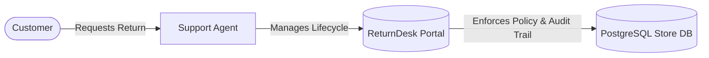

# EXPLAIN 1.0 — Product & Problem Domain (Conceptual)

## 1. What is ReturnDesk?
**ReturnDesk** is an operational web portal built for e-commerce customer support agents to process customer product returns, replacements, and store credits.

---

## 2. What Real-World Problem Does It Solve?

In online retail, customers frequently receive items that are damaged, the wrong size, not as described, or simply unwanted. 

### Without ReturnDesk (The Problem):
- Support agents track returns in spreadsheets, emails, or fragmented chat threads.
- Customers raise multiple duplicate return requests for the same damaged shirt, leading to double refunds.
- Agents approve returns without specifying whether the customer gets cash back or store credit.
- Return details get modified after money has already been refunded, destroying financial audit trails.
- Returns get deleted permanently from databases, preventing accountants and managers from auditing return rates.

### With ReturnDesk (The Solution):
- **Centralized Desk**: Agents have a single dashboard to search, filter, and review returns.
- **Automated Reference Generation**: Every return receives a unique, human-readable ID (`RD-000001`).
- **Enforced Business Policy**: The software guarantees that no invalid actions occur (e.g. you cannot jump from "Open" straight to "Completed", or edit details of a return that is already approved).
- **Resolution Tracking**: Approvals require an explicit resolution (`Refund`, `Replacement`, or `Store Credit`) and refund amounts are tracked to the exact cent.
- **Permanent Audit Trail**: Internal notes record history chronologically, and removed requests are soft-deleted rather than destroyed.

---

## 3. Who Uses ReturnDesk?
The primary user is the **Support Agent** (e.g. *Tier 1/Tier 2 Customer Support*). 

When a customer emails or calls customer service saying:
> *"I bought a pair of sneakers in Order #ORD-1002, but they are too small. I want to return them."*

The support agent opens ReturnDesk, checks the order, raises the ticket, reviews the reason, approves the return with a refund or replacement, and closes the ticket when finished.

---

## 4. Summary Mental Model

