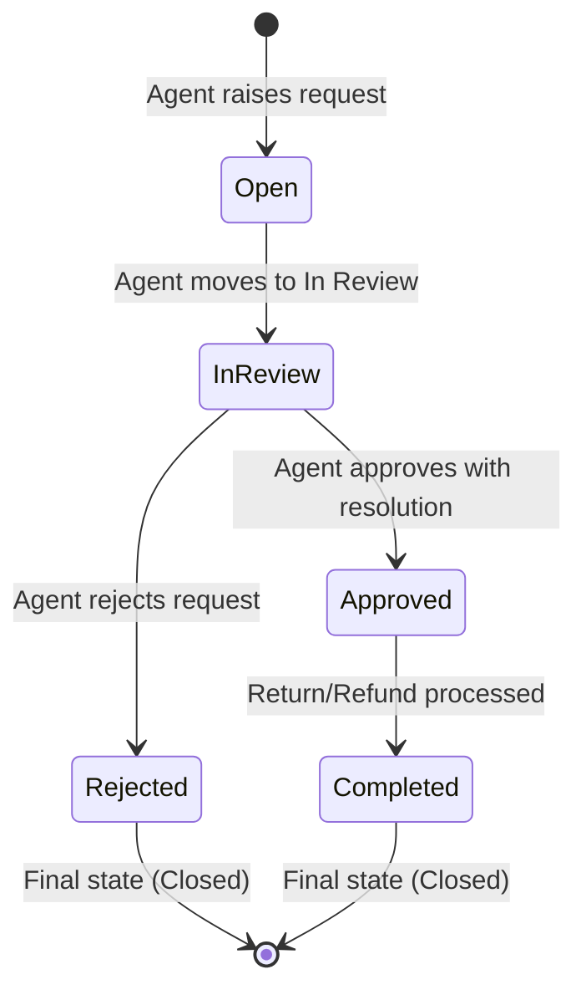

# EXPLAIN 4.0 — Business Flows & Lifecycle (Conceptual)

## 1. The Core Lifecycle of a Return Request

Every return request moves forward through a strict **5-state pipeline**:

---

## 2. Walkthrough of the 4 Main User Journeys

### Flow A: Raising a New Return Request
1. Agent receives customer complaint via call/email.
2. Agent clicks **"+ New Return"** on the dashboard.
3. Agent enters order number, customer name, email, item name, quantity, and selects a reason (`Damaged`, `Size Issue`, etc.).
4. System checks that the customer does not already have an active return for this exact item on this order.
5. System creates the ticket in **`Open`** status and generates a reference number (e.g. `RD-000034`).

---

### Flow B: Investigating & Moving to "In Review"
1. Agent opens ticket `RD-000034` from the table.
2. Agent clicks **"Move to In Review"**.
3. Status changes to **`In Review`**.
4. Agent writes a note in the internal notes panel: *"Requested photo proof from customer."*

---

### Flow C: Deciding — Approving with Resolution
1. Agent confirms the item was indeed defective.
2. Agent clicks **"Move to Approved"**.
3. System opens the **Approval Modal** requiring a resolution:
   - If **Refund**: Agent enters dollar amount (e.g. `$49.99`).
   - If **Replacement** or **Store Credit**: No dollar amount is recorded.
4. Agent confirms. Status becomes **`Approved`**.
5. **Locked State Triggered**: Form fields disable, "Save Changes" disappears, and details can no longer be edited.
6. Once the warehouse receives the item and the refund is paid, the agent clicks **"Move to Completed"**. The ticket closes permanently.

---

### Flow D: Deciding — Rejecting
1. Agent checks delivery date and finds the order was delivered 90 days ago (outside the 30-day return policy).
2. Agent clicks **"Move to Rejected"**.
3. Agent enters an internal note: *"Rejected: Return window expired."*
4. Status becomes **`Rejected`** (final state).
5. If desired, agent clicks **"Remove"** to take the rejected ticket off the active desk view.
