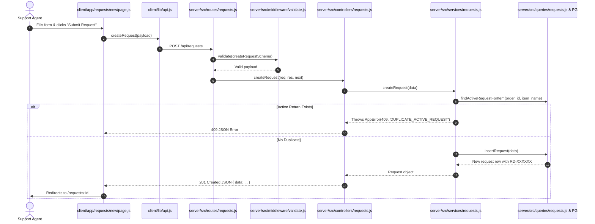

# EXPLAIN 4.1 — Business Flows in Code (Step-by-Step Execution Traces)

This document traces the exact execution path across the codebase for the main user flows.

---

## 1. Flow 1: Submitting a New Return Request

---

## 2. Flow 2: Transitioning Status to "Approved" with Refund

1. **User Action**: Agent opens `RD-000034` in `In Review` state, clicks `Move to Approved`, selects `Refund`, enters `$49.99`, and clicks `Confirm Approved`.
2. **Frontend Call**:
   - `client/components/StatusTransitionModal.js` invokes `onConfirm({ status: 'Approved', resolution: 'Refund', refund_amount: 49.99 })`.
   - `client/lib/api.js` executes `PATCH /api/requests/:id/status`.
3. **Backend Middleware**:
   - `server/src/middleware/validate.js` runs `transitionStatusSchema` (verifies enum strings).
4. **Controller Layer**:
   - `server/src/controllers/requests.js` extracts `req.params.id` and `req.body` and calls `services.transitionRequestStatus`.
5. **Service Layer (`services/requests.js`)**:
   - `findRequestById(id)` loads existing record.
   - `validateStatusTransition('In Review', 'Approved')` verifies transition is legal per `LEGAL_TRANSITIONS`.
   - `validateApprovalResolution('Refund', 49.99)` verifies refund amount is present and `> 0`.
6. **Query Layer (`queries/requests.js`)**:
   - Executes `UPDATE return_requests SET status = 'Approved', resolution = 'Refund', refund_amount = 49.99, updated_at = NOW() WHERE id = $1 RETURNING *;`.
7. **Response & UI Update**:
   - Backend returns `200 OK` with updated JSON object.
   - Frontend sets `request` state, changes badge to green `Approved`, renders locked banner, and disables detail inputs.

---

## 3. Flow 3: Appending an Internal Note (Optimistic UI Flow)

1. **User Action**: Agent types `"Customer confirmed packaging is damaged"` and clicks `+ Add Note`.
2. **Optimistic UI (`client/components/NotesSidebar.js`)**:
   - UI immediately creates a temporary note object `{ id: 'temp-172...', content: '...', created_at: new Date() }` and pushes it into the local `notes` state.
   - The note appears instantly in the list with zero visible lag.
3. **API Execution**:
   - Invokes `addNote(requestId, content)` -> `POST /api/requests/:id/notes`.
4. **Backend Processing**:
   - `services.addNote(requestId, content)` -> `queries.insertNote(requestId, content)`.
   - PostgreSQL executes `INSERT INTO notes (request_id, content) VALUES ($1, $2) RETURNING *;`.
5. **Reconciliation**:
   - When the server responds `201 Created`, the temporary note ID in state is replaced with the permanent PostgreSQL UUID.
   - If the network request fails, the temporary note is removed and an error alert is displayed.
