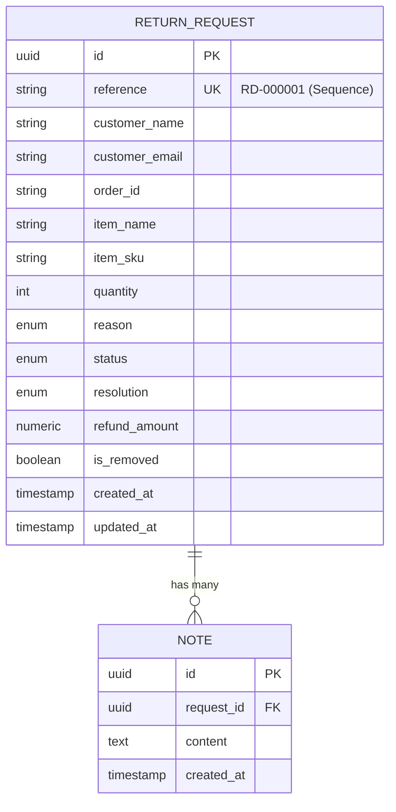

# EXPLAIN 7.0 — Database & Data Model (Conceptual)

## 1. Why PostgreSQL for ReturnDesk?

The assignment brief requires data to survive server restarts. For an e-commerce operational desk managing returns and money, a **relational SQL database (PostgreSQL)** is the ideal choice.

---

## 2. Entity-Relationship Conceptual Model

---

## 3. Core Database Principles Applied

1. **Explicit Data Integrity**:
   - Statuses and reasons cannot be arbitrary strings—they are constrained by PostgreSQL ENUM types.
   - Quantities must be positive integers (`CHECK (quantity >= 1)`).
2. **Atomic Numbering**:
   - Reference IDs (`RD-000001`) are generated from an atomic database sequence (`request_ref_seq`). Two concurrent inserts will never collide.
3. **Audit Trails & Soft Deletion**:
   - Records are never erased with `DELETE FROM return_requests`. Instead, `is_removed` is set to `TRUE`, preserving historical records for accountant reviews.
4. **Active Request Constraint**:
   - A partial unique index guarantees that only **one active return** can exist for a given `(order_id, item_name)` pair at any time.
